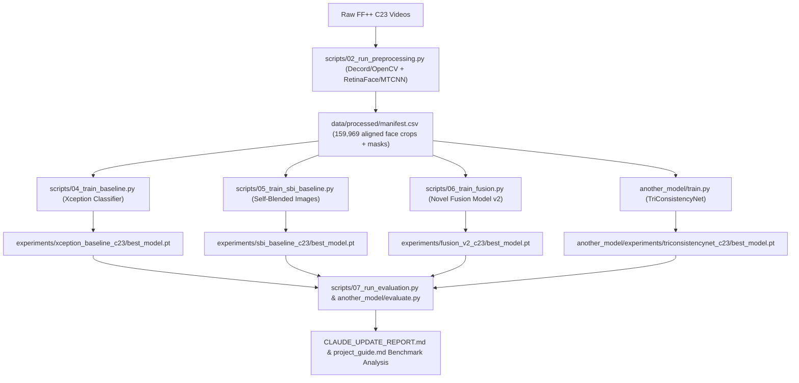

# Deepfake Detection Research — Comprehensive Project Guide

**Author & Project Lead:** Shashank Singh Singhania  
**Repository:** `deepfake-detection-research`  
**Dataset:** FaceForensics++ (FF++) C23 Quality  
**Hardware:** NVIDIA DGX Node (A100 40GB GPU)  
**Date:** July 2026  

---

## 1. Literature Review & Gap Analysis

### 1.1 Summary of Key Surveyed Papers

| Year | Venue | Paper Title & Authors | Core Idea / Category | Key Findings & Reported Results | Key Identified Limitations |
|---|---|---|---|---|---|
| 2019 | ICCV | **FaceForensics++** (*Rössler et al.*) | Benchmark & Baseline | Introduced FF++ dataset (DeepFakes, Face2Face, FaceSwap, NeuralTextures) at 3 compression levels (RAW, C23, C40). Xception baseline achieved **>99% AUC** intra-dataset. | No cross-manipulation or cross-dataset evaluation; compression robustness lightly studied. |
| 2020 | CVPR | **Face X-ray** (*Li et al.*) | Blending Boundary Artifacts | Detects blending boundary between forged face and background instead of method-specific artifacts. | Struggles when no blending boundary exists (e.g. fully generated GAN/diffusion faces). |
| 2021 | CVPR | **Multi-attentional Deepfake Detection** (*Zhao et al.*) | Spatial Attention & Texture | Uses multiple spatial attention heads + texture feature enhancement to aggregate forgery traces. | Attention maps not validated against ground-truth manipulation masks; drops on unseen generators. |
| 2021 | CVPR | **Pairwise Self-Consistency (PCL)** (*Li et al.*) | Inconsistency Learning | Learns source feature consistency within a face; inconsistency flags forged regions without explicit fake labels. | Consistency cues degrade under heavy compression (C23/C40) and small/low-res face crops. |
| 2021 | CVPR | **High-Frequency Feature Generalization** (*Luo et al.*) | Frequency-Domain (SRM) | Combines RGB features with high-frequency noise features (SRM filters) via a two-stream network with attention fusion. | High-frequency cues are sensitive to JPEG/video compression; heavy re-encoding suppresses the signal. |
| 2022 | CVPR | **Self-Blended Images (SBI)** (*Shiohara & Yamasaki*) | Synthetic Data Augmentation | Generates pseudo-fake training pairs by blending a source image with a transformed version of itself. Achieved **93%+ cross-dataset AUC** on Celeb-DF. | Landmark-based blending fails on extreme poses/occlusions; poor in-dataset performance when evaluated without threshold calibration. |
| 2022 | CVPR | **SLADD** (*Chen et al.*) | Adversarial Augmentation | Adversarially learns hardest forgery augmentations dynamically during training. | Adds training instability from adversarial loop; limited analysis on diffusion-based fakes. |
| 2022 | ECCV | **UIA-ViT** (*Zhuang et al.*) | Vision Transformer | ViT backbone with unsupervised patch-consistency loss to highlight inconsistent patches naturally. | Requires massive pretraining; attention interpretability as forgery localization only weakly verified. |
| 2023 | CVPR | **AltFreezing** (*Wang et al.*) | Video Temporal Modeling | 3D-CNN with alternating freeze/train strategy for spatial vs. temporal weights to force joint learning. | Computationally heavy; frame-based features are unguided by spatial manipulation masks. |
| 2023 | CVPR | **TALL** (*Xu et al.*) | Thumbnail Layout Video ViT | Rearranges short clip frames into a thumbnail layout grid for 2D Swin-Transformer spatio-temporal learning. | Layout tiling breaks fine-grained per-frame spatial localization. |
| 2023 | CVPR | **Implicit Identity Leakage** (*Dong et al.*) | Identity Disentanglement | Identifies that detectors memorize identity shortcuts rather than forgery artifacts; proposes identity disentanglement. | Only partially removes identity leakage; adds training complexity. |
| 2023 | CVPR | **UCF** (*Yan et al.*) | Common Feature Disentanglement | Disentangles forgery-irrelevant (identity/content) from common forgery features across manipulation methods. | Evaluated mainly on GAN/graphics fakes, not modern diffusion-based generation. |

---

### 1.2 Identified Literature Gaps

From our systematic review of 2019–2025 literature, 7 critical research gaps were identified:

1. **Compression Fragility (Gap #1):** Most detectors degrade drastically under compressed video protocols (C23/C40) because fine artifact signals are suppressed by quantization.
2. **Diffusion & Generator Over-fitting (Gap #2):** Detectors over-fit to specific GAN/graphics fingerprints and fail on unseen diffusion-based face swaps.
3. **Lack of Quantitative Explainability (Gap #3):** Most explainability claims rely solely on qualitative Grad-CAM visual inspections rather than quantitative validation against ground-truth manipulation masks (e.g. Pointing Game Accuracy, IoU).
4. **Single-Stream Feature Isolation (Gap #4):** Prior SOTA models focus on *only* semantic CLIP features OR frequency filters OR temporal consistency, rarely fusing them in a compression-aware manner with explicit mask-guided localization supervision.
5. **Identity Shortcut Memorization (Gap #5):** Deep fake classifiers memorize subject identity rather than learning forgery boundaries.
6. **Transformer / VLM Efficiency Ignored (Gap #6):** Multi-stream VLM/ViT architectures lack parameter and latency analysis for practical deployment.
7. **Benchmark Reality Gap (Gap #7):** Academic models reporting >99% intra-dataset AUC frequently collapse to 45–50% on real-world in-the-wild deepfakes.

---

### 1.3 Selected Research Gap & Project Objective

**Chosen Gap:** Fusing **semantic features** (CLIP ViT-B/32), **compression-aware frequency forensics** (SRM high-pass filters), and a **quantitative pixel-level explainability head** evaluated against ground-truth manipulation masks on compressed FF++ C23 data.

---

## 2. Project Implementation Status vs. Plan

| Phase | Planned Task | Status | Implementation Details & Artifacts |
|---|---|---|---|
| **Phase 0** | Environment Setup | **100% Complete** | Installed PyTorch (CUDA 12.4), `timm`, `open_clip_torch`, `albumentations`, `decord`, OpenCV on DGX A100. Pinned in `requirements.txt`. |
| **Phase 1 & 2** | Data Preprocessing & Manifest | **100% Complete** | Preprocessed 5,000 FF++ C23 videos into 159,969 face crops (224×224 / 299×299). Built `manifest.csv` with identity-preserved splits (`train`: 115,188, `val`: 22,384, `test`: 22,397) and ground-truth mask paths. Added decord fallback for video reading. |
| **Phase 3** | Baseline Reproduction | **100% Complete** | Trained Xception baseline (**98.44% AUC**) and SBI baseline (**71.10% AUC**, verified 1.6% landmark failure rate). Established upper/lower bounds. |
| **Phase 4** | Architecture Implementation | **100% Complete** | Built **Novel Fusion Model** (`src/models/fusion_model.py`) with dual-stream CLIP + SRM frequency branches + explainability head. Built **TriConsistencyNet** (`another_model/`) with EfficientNetV2-S + 2D FFT + Cross-Consistency Attention. |
| **Phase 5** | Training Protocol & Stability | **100% Complete** | Implemented FP16 AMP, Cosine LR scheduler, `max_grad_norm=1.0` gradient clipping, and `nan_to_num` + `clamp(0,1)` BCE guards to prevent CUDA device-side assertions. |
| **Phase 6** | Evaluation & Diagnostics Suite | **100% Complete** | Implemented `scripts/07_run_evaluation.py` and `another_model/evaluate.py`. Computes AUC, AP, EER, Accuracy, Balanced Accuracy per manipulation method (Deepfakes, Face2Face, FaceSwap, NeuralTextures), plus Pointing Game Accuracy and Mask IoU. |
| **Phase 7** | Refinement & Ablations | **In Progress** | Diagnostic suite identified that the Fusion localization head is *well-localized but under-confident* (IoU @ 0.5 = 0.03%, but IoU @ 0.10 threshold = **38.69%**, Pointing Game = **66.65%**). |

---

## 3. Project Workflow & Workflow History



---

## 4. Custom Technical Enhancements Implemented

1. **Decord Video Reader Fallback (`src/data/preprocess_ffpp.py`):**
   - Automatically falls back to `decord` when OpenCV `cv2.VideoCapture` fails on certain FFMPEG container codecs on Linux/DGX nodes.

2. **NaN Loss Guard & Gradient Clipping (`src/training/train_fusion.py`):**
   - Unscales gradients before clipping (`scaler.unscale_(optimizer)`).
   - Enforces `torch.nn.utils.clip_grad_norm_(model.parameters(), max_norm=1.0)` to prevent FP16 gradient explosion under AMP.
   - Wraps loss calculation in `torch.isfinite(loss)` check to drop corrupt batches without triggering `GradScaler` assertion errors.

3. **CUDA Device-Side Assert Guard for BCE Loss (`src/training/train_fusion.py`):**
   - Sanitizes spatial heatmap outputs before passing to `F.binary_cross_entropy()`:
     ```python
     heatmap_safe = torch.nan_to_num(heatmap.float(), nan=0.0, posinf=1.0, neginf=0.0).clamp(0.0, 1.0)
     ```
   - Prevents CUDA kernel crash (`Loss.cu:94`) when evaluating checkpoints with extreme activation values.

4. **Multi-Version Albumentations Compatibility (`another_model/src/dataset.py`):**
   - Dynamically inspects `Albumentations` version (1.x vs 2.x) to support positional `A.Resize(image_size, image_size)` and `quality_range` vs `quality_lower/upper` parameters without pydantic validation errors.

5. **Diagnostic Suite (`src/evaluation/metrics.py`):**
   - `compute_heatmap_stats()`: Computes mean, p90, p99, max, and fraction of pixels exceeding threshold 0.5.
   - `compute_best_threshold_iou()`: Sweeps thresholds [0.01 – 0.90] to separate spatial localization accuracy from activation confidence calibration.

---

## 5. Model Architectures & Benchmark Evaluation Results

### 5.1 Comprehensive Benchmark Comparison (FF++ C23 Test Split)

| Model | Overall AUC | Average Precision (AP) | Equal Error Rate (EER) | Balanced Accuracy | Raw Accuracy | Pointing Game Acc | Mask IoU |
|---|---|---|---|---|---|---|---|
| **Xception Baseline** | **98.44%** | 99.62% | 5.38% | 93.46% | 95.16% | N/A | N/A |
| **Novel Fusion Model v2** | **88.24%** | 96.42% | 19.29% | 77.22% | 85.11% | **66.65%** | **37.75%** (@ adaptive) / **38.69%** (@ thresh 0.10) |
| **TriConsistencyNet** | **80.66%** | 93.97% | 27.22% | 67.91% | 80.77% | N/A | N/A |
| **SBI Baseline** | **71.10%** | 90.31% | 34.96% | 53.37% | 25.95%* | N/A | N/A |

*\*Note: SBI's raw accuracy of 25.95% is caused by threshold miscalibration (predicting mostly real). Its true discrimination capability is measured by AUC (71.10%) and Balanced Acc (53.37%).*

---

### 5.2 Per-Manipulation Method AUC Breakdown

| Model | Deepfakes | Face2Face | FaceSwap | NeuralTextures |
|---|---|---|---|---|
| **Xception Baseline** | **99.15%** | **98.91%** | **98.74%** | **96.98%** |
| **Novel Fusion Model v2** | **93.14%** | **88.64%** | **89.78%** | **81.40%** |
| **TriConsistencyNet** | **84.37%** | **81.13%** | **79.93%** | **77.22%** |
| **SBI Baseline** | **81.26%** | **71.01%** | **64.47%** | **67.65%** |

---

### 5.3 Architectural Details

#### A. Novel Fusion Model (`src/models/fusion_model.py`)
- **Semantic Branch:** OpenAI ViT-B/32 CLIP backbone (penultimate layer, top 2 Transformer blocks unfrozen). Produces a 512-dim semantic feature vector.
- **Frequency Branch:** Fixed Spatial Rich Model (SRM) high-pass filters (3 kernels: $5\times5$) $\rightarrow$ 3-layer trainable Conv-BN-ReLU CNN. Produces a $128\times56\times56$ spatial feature map.
- **Cross-Domain Adapter & Fusion:** Fuses semantic and frequency representations via spatial projection and concatenation.
- **Dual Heads:**
  1. Classification Head: Linear classifier predicting binary Real/Fake probability.
  2. Localization Head: $1\times1$ Convolution + Sigmoid predicting $224\times224$ pixel-level manipulation heatmap supervised by ground-truth masks.
- **Parameters:** 88.2M Total | 14.9M Trainable (17.0%).

#### B. TriConsistencyNet (`another_model/src/model.py`)
- **Spatial Branch:** Frozen `tf_efficientnetv2_s` backbone $\rightarrow$ $1280\times7\times7$ spatial feature map.
- **Frequency Guidance Encoder (FGE):** 2D Fast Fourier Transform magnitude spectrum ($\log(1 + |F|)$ log compression + per-sample normalization) $\rightarrow$ 0.8M parameter CNN $\rightarrow$ $256\times7\times7$ frequency feature map.
- **Cross-Consistency Attention (CCA):** Projects spatial and frequency streams into a shared 1280-channel space. Computes element-wise product $C = S_p \odot F_p$, passes through a gating network to compute spatial attention $A \in [0, 1]$, and refines spatial features via residual multiplication $S_{\text{refined}} = S \odot (1 + A)$.
- **Adaptive Feature Fusion (AFF):** Squeeze-and-Excitation channel gate calibrating global average pooled features before classification.
- **Parameters:** 27.2M Total | 7.09M Trainable (26.0%).

#### C. Xception Baseline (`src/models/baseline.py`)
- Standard legacy Xception architecture pretrained on ImageNet, fine-tuned end-to-end with CrossEntropyLoss on 299×299 face crops.

#### D. SBI Baseline (`src/data/sbi_dataset.py` & `src/data/sbi_blend.py`)
- Self-Blended Images augmentation generating pseudo-fake faces by landmark-guided blending of source face crops with self-transformed cutouts.

---

## 6. Project Goals & Next Action Plan

### 6.1 Core Goals & Benchmark Targets
1. **Target Model to Improve:** **Novel Fusion Model** (currently **88.24% AUC**).
2. **Target Score to Beat:** Close the gap to **Xception Baseline (98.44% AUC)** while maintaining quantitative explainability.
3. **Primary Limitation Identified in Fusion Model:**
   - Diagnostic heatmap analysis revealed:
     `heatmap: mean=0.1055 p90=0.2367 p99=0.3688 max=0.8756 frac>0.5=0.0001 | best_iou=0.3891 @thresh=0.10 (iou@0.5=0.0005)`
   - The localization head has strong spatial pointing accuracy (**66.65% Pointing Game**), but its sigmoid outputs are **under-confident** (clustering in 0.10–0.35 range). Standard 0.5 threshold yields near-zero IoU, whereas threshold 0.10 yields **38.69% IoU**.

### 6.2 Actionable Next Steps
1. **Loss Function Refinement for Fusion Model:**
   - Replace standard BCE mask loss with **Focal BCE** or add a **Dice Loss** component to force the localization head to emit confident activations without saturating near zero.
2. **Increase Mask Loss Weight:**
   - Test scaling `mask_weight` from 2.0 to 4.0/5.0 now that gradient clipping (`max_grad_norm=1.0`) prevents FP16 gradient explosion.
3. **Cross-Dataset Evaluation Protocol:**
   - Evaluate Fusion v2 and Xception on Celeb-DF v2 test split to verify whether Fusion's dual-stream architecture offers superior zero-shot cross-dataset generalization over Xception.

---

## 7. Complete Repository File Structure

```text
deepfake-detection-research/
├── CLAUDE_UPDATE_REPORT.md             # High-level update report artifact
├── PROJECT_STRUCTURE.md                # Architectural summary document
├── README.md                           # Main repository readme
├── project_guide.md                    # THIS Comprehensive Project Guide
├── requirements.txt                    # Pinned Python dependencies
│
├── another_model/                      # TriConsistencyNet Standalone Package
│   ├── evaluate.py                     # Test evaluation script with per-method breakdown
│   ├── evaluate_triconsistencynet.py   # Legacy evaluation entrypoint
│   ├── mode_architecture.md            # TriConsistencyNet design specification
│   ├── model.py                        # Legacy model file
│   ├── test_triconsistencynet.py       # Forward-pass sanity check script
│   ├── train.py                        # Standalone training entrypoint (reads manifest.csv)
│   ├── train_triconsistencynet.py      # Legacy training script
│   └── src/
│       ├── __init__.py                 # Subpackage init
│       ├── attention.py                # Cross-Consistency Attention (CCA) module
│       ├── dataset.py                  # Standalone dataset reader (Albumentations 1.x/2.x compatible)
│       ├── frequency.py                # 2D FFT Frequency Guidance Encoder (FGE) module
│       ├── fusion.py                   # Adaptive Feature Fusion (AFF) SE module
│       └── model.py                    # Combined TriConsistencyNet PyTorch model
│
├── configs/                            # Configuration YAML files
│   ├── dataset.yaml                    # Dataset parameters
│   ├── model.yaml                      # Model architecture parameters
│   └── training.yaml                   # Hyperparameters & optimizer configuration
│
├── data/                               # Dataset directory
│   ├── processed/
│   │   └── manifest.csv                # Master dataset index (159,969 frames, splits, mask paths)
│   ├── raw/                            # Raw extracted video frames
│   └── splits/                         # Official FF++ train/val/test CSV splits
│
├── docs/                               # Literature review & documentation
│   └── literature_review_deepfake.xlsx # Matrix of 13+ surveyed papers, gaps, & execution plan
│
├── experiments/                        # Saved checkpoints, logs, & metrics
│   ├── fusion_v1_c23/                  # Fusion v1 run directory
│   ├── fusion_v2_c23/                  # Fusion v2 run directory (best_model.pt)
│   ├── sbi_baseline_c23/               # SBI baseline run directory (best_model.pt)
│   ├── triconsistencynet_c23/          # TriConsistencyNet run directory (best_model.pt)
│   └── xception_baseline_c23/          # Xception baseline run directory (best_model.pt)
│
├── scripts/                            # Executable pipeline scripts
│   ├── 00_verify_env.py                # Verify PyTorch CUDA & GPU environment
│   ├── 01_check_splits.py              # Validate identity-preserved dataset splits
│   ├── 02_run_preprocessing.py         # Frame extraction & face alignment pipeline
│   ├── 03_check_dataloader.py          # PyTorch DataLoader sanity check
│   ├── 04_train_baseline.py            # Xception baseline training entrypoint
│   ├── 05_train_sbi_baseline.py        # SBI baseline training entrypoint
│   ├── 06_train_fusion.py              # Novel Fusion Model training entrypoint
│   └── 07_run_evaluation.py            # Multi-protocol evaluation suite
│
├── src/                                # Core codebase library
│   ├── data/
│   │   ├── __init__.py
│   │   ├── dataset.py                  # Main FF++ Dataset & DataLoader builder
│   │   ├── ffpp_splits.py              # Identity split generator
│   │   ├── preprocess_ffpp.py          # Face detection & decord video reader
│   │   ├── sbi_blend.py                # Self-blended image augmentation engine
│   │   └── sbi_dataset.py              # SBI dataset generator with landmark preflight check
│   ├── evaluation/
│   │   ├── __init__.py
│   │   ├── evaluate.py                 # Evaluation orchestration module
│   │   └── metrics.py                  # AUC, AP, EER, Balanced Acc, Heatmap Stats, Pointing Game, IoU
│   ├── models/
│   │   ├── __init__.py
│   │   ├── baseline.py                 # Xception model architecture
│   │   └── fusion_model.py             # Dual-stream CLIP + SRM Fusion Model
│   └── training/
│       ├── __init__.py
│       ├── checkpoint.py               # Checkpoint manager with patience counter restoration
│       ├── engine.py                   # Standard training & validation loop engine
│       └── train_fusion.py             # Fusion training engine (grad clipping + NaN guards)
│
└── tests/                              # Unit & integration tests
```
